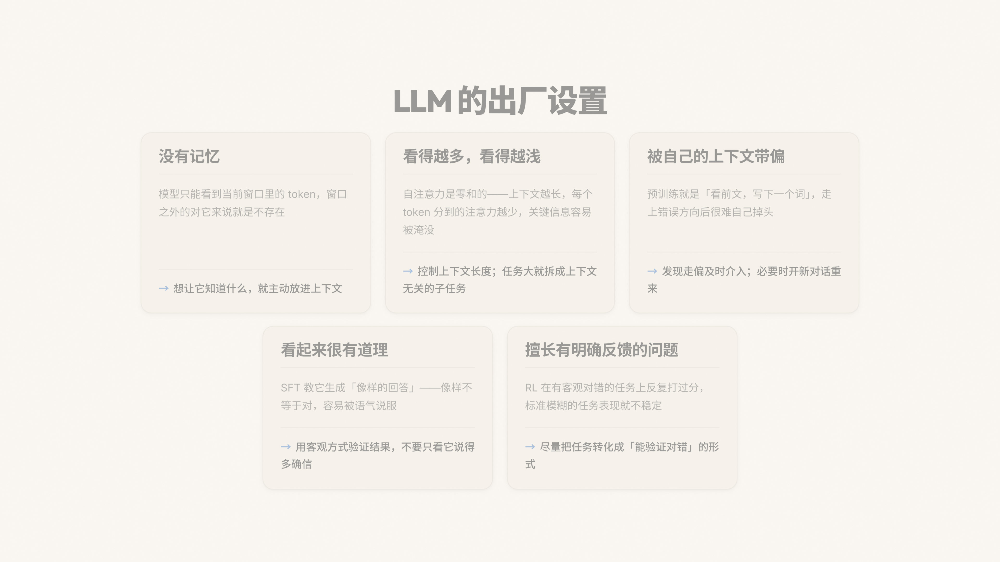
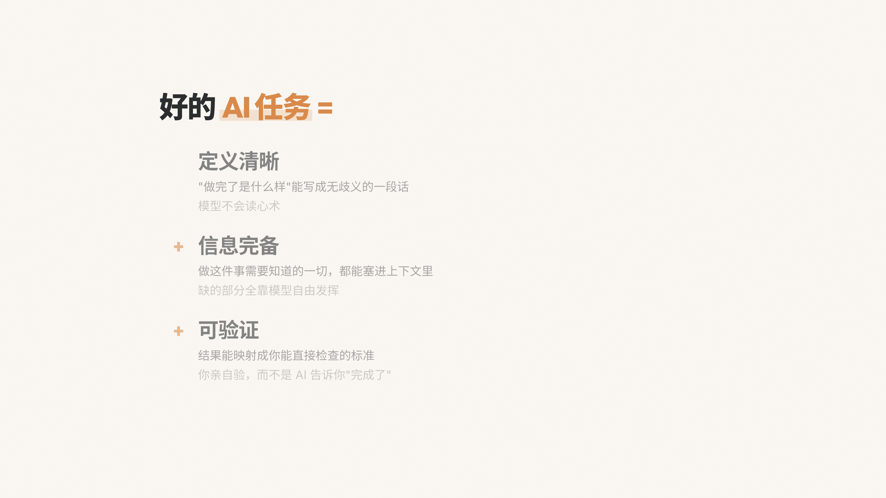
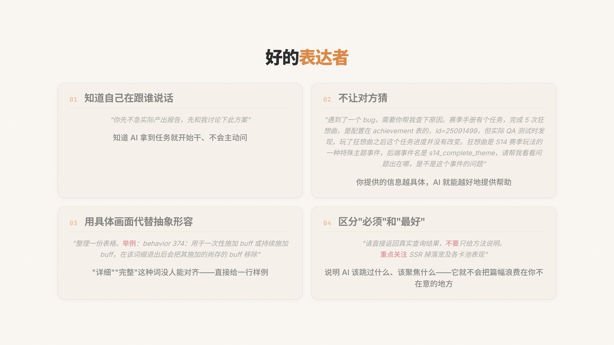
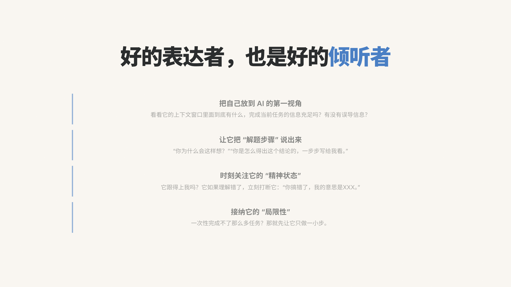
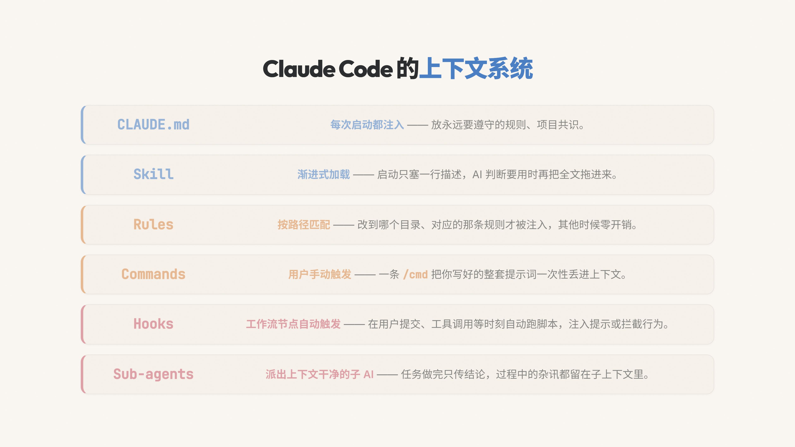
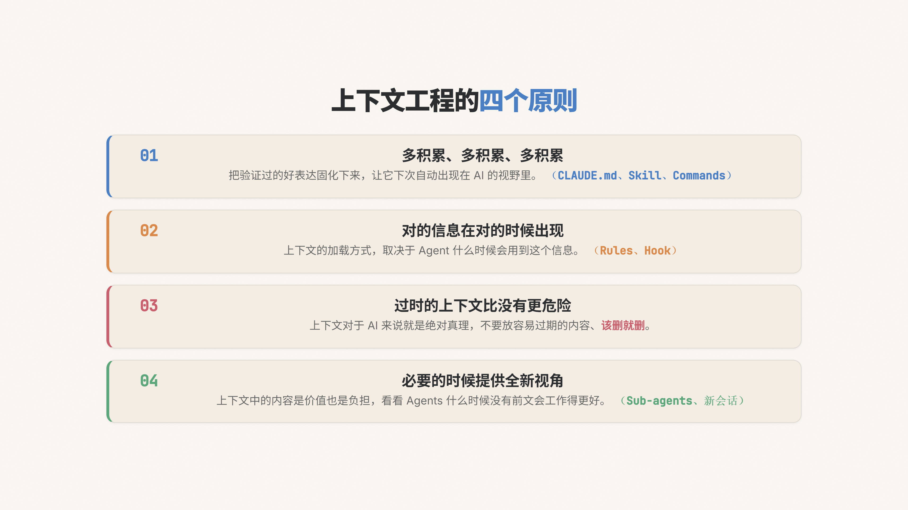
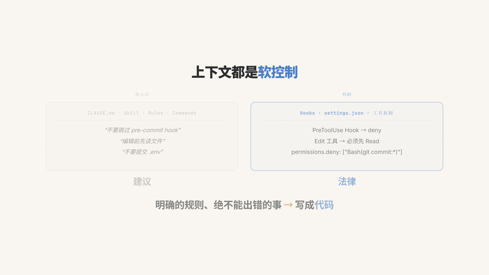

# 如何与 AI 合作 · 演讲幻灯片

> 一份内部技术分享的演讲幻灯片：从模型为什么会犯错讲起，落到怎么写出 AI 真正能做对的任务、怎么管理它的上下文。

**[在线完整版（reveal.js · 33 页）→](https://koukekoukej-glitch.github.io/ai-collab-talk/part1.html)**

---

## 节选高光

下面是这场分享里信息密度最大的 7 页。完整版还有章节过渡、动画演示和大量配图。

### LLM 的 5 个出厂设置

把模型的核心局限拆成 5 件事：没有记忆、注意力会被稀释、容易被前文带偏、SFT 让它"答得像样不等于答得对"、RL 偏好有客观对错的任务。每张卡片配一句"该怎么应对"。

### 好的 AI 任务 = 定义清晰 + 信息完备 + 可验证

把模糊的"prompt 怎么写"收敛成三个可判断的条件。任何一条不满足，结果就不可控。

### 好的表达者：4 条

四条表达原则配真实工作场景的反例：知道在跟谁说话、不让对方猜、用具体画面代替抽象形容、区分"必须"和"最好"。

### 好的倾听者：4 条

光会说不够 —— 还得能看出 AI 现在在想什么、有没有跑偏、什么时候该打断。

### Claude Code 的上下文系统：6 个机制

把 Claude Code 提供的 6 种上下文注入方式按"什么时候、怎么进入上下文窗口"拆开：CLAUDE.md、Skill、Rules、Commands、Hooks、Sub-agents。

### 上下文工程的 4 个原则

为什么、什么时候、怎么积累上下文 —— 以及什么时候应该清空重来。

### 软控制 vs 硬控制

提示词只是"建议"，真正想约束 AI 行为要写成代码（hooks、permissions）。明确的规则、绝不能出错的事必须用硬控制。

---

## 关于这份文件

- **技术栈**：纯静态 HTML + reveal.js 5.1 + 自定义 CSS，无构建步骤
- **完全离线**：reveal.js、5 个字体家族、所有插图全部本地打包，断网也能播放
- **设计语言**：暖白底色 + 编辑式排版，完整设计规范在 [`STYLE-GUIDE.md`](STYLE-GUIDE.md)
- **本地播放**：克隆仓库后双击 `part1.html`，用 Chrome / Edge / Firefox 打开
